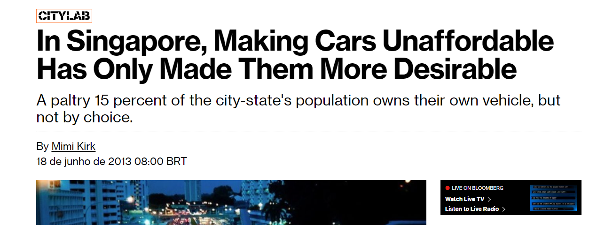
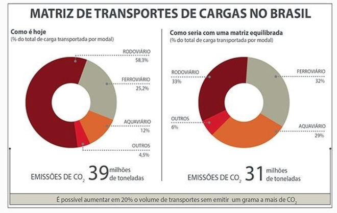
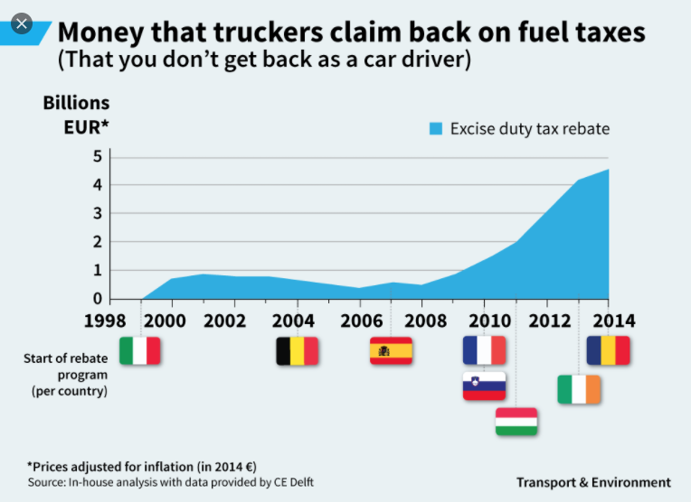

```{r child = "setup.Rmd"}
```

```{r xaringan-tile-view, echo=FALSE}
xaringanExtra::use_tile_view()
```

```{r xaringan-editable, echo=FALSE}
xaringanExtra::use_editable(expires = 1)
```

```{r xaringan-panelset, echo=FALSE, message=FALSE, warning=FALSE}
xaringanExtra::use_panelset()
xaringanExtra::style_panelset_tabs(panel_tab_font_family = "sans-serif")
```

```{r xaringanExtra-clipboard, echo=FALSE}
htmltools::tagList(
  xaringanExtra::use_clipboard(
    button_text = "<i class=\"fa fa-clipboard\"></i>",
    success_text = "<i class=\"fa fa-check\" style=\"color: #90BE6D\"></i>",
    error_text = "<i class=\"fa fa-times-circle\" style=\"color: #F94144\"></i>"
  ),
  rmarkdown::html_dependency_font_awesome()
)
```

```{r xaringan-fit-screen, echo=FALSE}
xaringanExtra::use_fit_screen()
```

```{r xaringan-extra-styles, echo=FALSE}
xaringanExtra::use_extra_styles(
  hover_code_line = TRUE,         #<<
  mute_unhighlighted_code = TRUE  #<<
)
```

```{r broadcast, echo=FALSE}
xaringanExtra::use_broadcast()
```

```{r xaringan-scribble, echo=FALSE}
xaringanExtra::use_scribble()
```

class: center, middle

## Retrospecto

---

## Definições

### Logística

.midi[
.question[
“**Logística** é dispor a **mercadoria ou o serviço** certo, no **lugar** certo, no **tempo** certo e nas **condições desejadas**, ao mesmo tempo em que fornece a **maior contribuição à empresa**”. 
(Ballou, 2001)
]
]

### Gestão Cadeia de Suprimentos

.question[
.midi[
**Cadeia de suprimentos** é a estrutura consolidada e integrada, em níveis estratégico, tático e operacional, entre agentes de produção, mercadológicos, logísticos e sociedade, para que seja possível coordenar as operações de maneira a garantir a gestão orientada à logística, tendo como objetivo o _trade-off_ entre **responsividade** e **eficiência**, além de garantia de um contexto sustentável de desenvolvimento por ações **socialmente responsáveis** e **resilientes.** 
]
]

---

## Fatores-chave de desempenho

- Instalações   
- Estoques   
- Transportes   
- Informação   
- Sourcing   
- Pricing

---


## Logística Urbana
[Livro](https://podeditora.com.br/wp-content/uploads/2019/04/Livro-A-logistca-urbana-no-Brasil-site.pdf)

Digital Twins

Physical internet

---

class: center, middle

## Transportes

---
# Modos de transporte

**Quais são os modos utilizados para movimentação de cargas?**
<br></br>


--

Rodoviário
<br></br>
--

Ferroviário
<br></br>
--

Aquaviário
<br></br>
--

Dutoviário
<br></br>
--

Aéreo
<br></br>
--

Eletrônico


---
### Transportes....

```{r echo=FALSE, message=FALSE, warning=FALSE}

```

---
### Transportes....

```{r echo=FALSE, message=FALSE, warning=FALSE}

```


---
### Transportes....

```{r echo=FALSE, message=FALSE, warning=FALSE}

```


---

class: center, middle

## Qual o(s) problema(s) do Brasil em relação à movimentação de cargas em escala regional?


---

class: center

### No mundo....

```{r echo=FALSE, message=FALSE, warning=FALSE}
knitr::include_graphics("./img/japao.png")
```

---

class: center

### No mundo....

```{r echo=FALSE, message=FALSE, warning=FALSE}

```

---

class: center

### No mundo....

```{r echo=FALSE, message=FALSE, warning=FALSE}
knitr::include_graphics("./img/fly_tax.png")
```

---

class: center

### No mundo....

```{r echo=FALSE, message=FALSE, warning=FALSE}
knitr::include_graphics("./img/zero_emission.png")
```

---

class: center

### No mundo....

```{r echo=FALSE, message=FALSE, warning=FALSE}
knitr::include_graphics("./img/electric vechicle.png")
```

---

class: center

### No mundo....

```{r echo=FALSE, message=FALSE, warning=FALSE, out.width="50%"}
knitr::include_graphics("./img/growth_emission.png")
```

---
### Qual o nosso problema?
Preço do petróleo?

```{r echo=FALSE, message=FALSE, warning=FALSE}
knitr::include_graphics("./img/diesel.png")
```

---
### Rodovias

```{r echo=FALSE, message=FALSE, warning=FALSE}
knitr::include_graphics("./img/mapa_rodo.jpg")
```


---
### Ferrovias

```{r echo=FALSE, message=FALSE, warning=FALSE}
knitr::include_graphics("./img/mapa_ferro.png")
```


---
### Aquaviário - Águas interiores

```{r echo=FALSE, message=FALSE, warning=FALSE}
knitr::include_graphics("./img/hidro.png")
```

---


### Qual o nosso problema?
Demanda x oferta?

```{r echo=FALSE, message=FALSE, warning=FALSE}
knitr::include_graphics("./img/peroba.png")
```

---
### Qual o nosso problema?
Matriz modal?

```{r echo=FALSE, message=FALSE, warning=FALSE}

```

---

### Qual o nosso problema?
Matriz modal?

```{r echo=FALSE, message=FALSE, warning=FALSE}
knitr::include_graphics("./img/matriz.png")
```

---
### Qual o nosso problema?
Matriz modal?

```{r echo=FALSE, message=FALSE, warning=FALSE}
knitr::include_graphics("./img/ferro.png")
```

---

### Qual o nosso problema?
Matriz modal?

```{r echo=FALSE, message=FALSE, warning=FALSE}
knitr::include_graphics("./img/investimento.png")
```

---

### Qual o nosso problema?
Matriz modal?

```{r echo=FALSE, message=FALSE, warning=FALSE}
knitr::include_graphics("./img/matriz_compara.png")
```

---
### Qual o nosso problema?
Matriz modal?

```{r echo=FALSE, message=FALSE, warning=FALSE}
knitr::include_graphics("./img/ferrovias_mundo.png")
```

---

### Qual o nosso problema?
Matriz modal?

```{r echo=FALSE, message=FALSE, warning=FALSE}
knitr::include_graphics("./img/conteiner.png")
```

---

### Qual o nosso problema?
Custo da produção de transportes

```{r echo=FALSE, message=FALSE, warning=FALSE}
knitr::include_graphics("./img/artigoNovembro2014_Figura05.png")
```

---

### Qual o nosso problema?
Eficiência da produção de transportes

```{r echo=FALSE, message=FALSE, warning=FALSE}
knitr::include_graphics("./img/efici.png")
```


---

### Como resolver?

"Bolsa Caminhoneiro"?

```{r echo=FALSE, message=FALSE, warning=FALSE}
knitr::include_graphics("./img/bolsa.png")
```

---

### Como resolver?

"Bolsa Caminhoneiro"?

```{r echo=FALSE, message=FALSE, warning=FALSE}

```

---

### Como resolver?

Realocação de recursos? 
Eliminar piso de gastos com educação e saúde para subsidiar Diesel?
Intervir na Petrobrás?
Privatizar a Petrobras?

```{r echo=FALSE, message=FALSE, warning=FALSE}
knitr::include_graphics("./img/calamidade.png")
```


---
### Como resolver?


- Fim da política de preços da Petrobras para os combustíveis
- Cumprimento do piso mínimo de frete

```{r echo=FALSE, message=FALSE, warning=FALSE}
knitr::include_graphics("./img/greve01.png")
```

---

class: center, middle

.larger[
**DÚVIDAS?**
]
